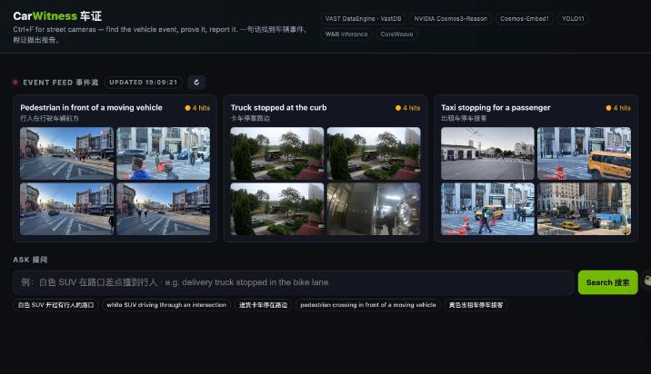
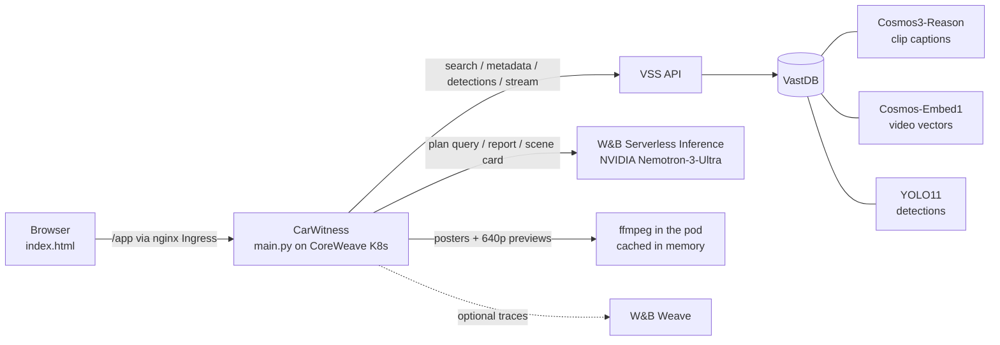

# CarWitness 车证

> 一句话找到街头摄像头里的车辆事件，附可播放证据，自动生成中英双语报告。

**Ctrl+F for street cameras.** CarWitness does Clearcam-style detection, search and alerts, focused on vehicles. Ask in English or Chinese, get matching clips from every camera, and turn them into an evidence-backed incident report or an AV-simulation scene card. It runs on VAST DataEngine and NVIDIA Cosmos.

Built for the **VAST Builders Challenge NYC**. Live app: open https://workshop.thecosmoslabs.com → **App** (team 39).



---

## The problem

Dealers, insurers, fleet operators and AV teams all need to know what happened to a vehicle on the street: who cut in, who double-parked, how close the cyclist got. The footage exists, but it's hours of video per camera per day and nobody watches it. Finding one 10-second moment means scrubbing timelines by hand, and the result is a screenshot with no structured record.

## What it does

| Feature | Details |
|---|---|
| **Event feed** 事件流 | Standing alert rules (pedestrian in front of a moving vehicle, truck stopped at the curb, taxi stopping for a passenger) re-run against the archive every 5 min across all 10 cameras (New York, San Francisco, Toronto, residential). Hover a thumbnail to play it, click it to open the search. Rules can be configured with `FEED_RULES_JSON`. |
| **Bilingual natural-language search** 双语搜索 | Type something like `白色 SUV 在路口差点撞到行人`. NVIDIA Nemotron turns it into a concrete visual English query plus an event type, then VSS semantic search runs over Cosmos-Embed1 vectors on every camera. |
| **Evidence cards** 证据卡 | Each hit shows a JPEG poster and a 640p preview (made once with ffmpeg and cached: ~50 KB instead of the 5–10 MB 1080p segment, with an **HD** link to the original), the Cosmos3-Reason description, similarity score, camera and time window, and YOLO11 object counts. |
| **Bilingual incident report** 双语报告 | Pick the clips to use as evidence and get an EN + 中文 report. Event types come from a **closed vocabulary** (`pedestrian-conflict`, `cut-in`, `double-parked`, …). Every finding must **cite an evidence clip ID**. A server-side guardrail **drops any finding that is off-vocabulary or cites no real clip** and shows how many it dropped. Clicking a citation jumps to that clip and plays it. |
| **AV corner-case scene card** 场景卡 | One click turns a real clip into a simulation-ready JSON scenario: actors, maneuvers, environment, conflict point, expected AV behavior and variations to simulate. Unknowns are marked `unknown`, and the card links back to the source clip and evidence. |

## How it differs from the VSS sample UI

The organizers' Video Search & Summary UI is a general-purpose search box: English query in, ranked clips and a free-text summary out. CarWitness uses the same VSS search as its retrieval layer and adds the "insight or action" layer on top:

| | VSS sample UI | CarWitness |
|---|---|---|
| Scope | Any video, any question | Vehicle incidents, with a fixed event vocabulary |
| Mode | You search | Alert rules run on their own (event feed), plus search |
| Input | English search terms | English or Chinese sentence, interpreted by Nemotron |
| Output | Clip list + free-text summary | Bilingual incident report: event types, risk, confidence, recommended action |
| Trust | — | Every finding must cite a clip; unsupported findings are dropped and counted |
| Downstream | — | AV-simulation scene card (JSON) per clip |

## Architecture



- **Ingest (VAST DataEngine):** footage lands in VAST S3. DataEngine functions caption each clip with Cosmos3-Reason, embed it with Cosmos-Embed1 and run YOLO11, and the results are written to VastDB.
- **App:** a single stdlib-Python server (`app/main.py`) plus one HTML page. There is no build step, so the pod starts from `python:3.12-slim` with the code mounted from a ConfigMap.
- **LLM:** NVIDIA Nemotron-3-Ultra (`nvidia/NVIDIA-Nemotron-3-Ultra-550B-A55B`) on W&B Inference, so the whole chain from video understanding to report writing runs on NVIDIA models. `deploy.sh` pins it by default; override with `LLM_MODEL`. If `weave` is installed, calls are traced.

## Tools used

VAST DataEngine, VastDB, VAST S3 · NVIDIA Cosmos3-Reason · NVIDIA Cosmos-Embed1 · YOLO11 · NVIDIA Nemotron-3-Ultra on W&B Serverless Inference · CoreWeave Kubernetes · ffmpeg · Cursor · Claude Code · OpenAI Codex

## How to run

**Deploy (team VM):**

```bash
export WANDB_API_KEY=...            # if it's not already in the env or /config/*.config
./deploy.sh                         # ConfigMap + Secret + Deployment/Service/Ingress, restart, health check
./deploy.sh logs                    # tail logs
./deploy.sh status                  # pods / svc / ingress
```

Then open https://workshop.thecosmoslabs.com and click **App**. The script reads `USERNAME`, `PASSWORD` and `INGRESS_URL` from `/config/*.config`. It finds kubeconfig at `/config/<team>-k8s.yaml` or `/config/kubeconfig`, and it never prints secret values.

**Local dev (mock backend):**

```bash
dev/run_local.sh                    # runs main.py against a local mock VSS/LLM; open the printed URL
```

**Environment variables:** `VSS_URL`, `VSS_USERNAME`, `VSS_PASSWORD`, `WANDB_API_KEY`, `WANDB_TEAM`, `WANDB_PROJECT`, optional `LLM_MODEL`, `LLM_BASE_URL`, `FEED_RULES_JSON`, `PORT` (default 8080).

## API routes

| Method | Path | Purpose |
|---|---|---|
| GET | `/` | Web UI |
| GET | `/health` | Readiness probe → `{"ok": true}` |
| GET | `/api/config` | Event vocabulary, feed rules, active model |
| GET | `/api/feed` | Latest event-feed results (refreshed every 5 min) |
| POST | `/api/feed/refresh` | Re-run all feed rules now |
| POST | `/api/search` | `{query, top_k?, min_similarity?}` → query plan + normalized hits |
| GET | `/api/detections?source=` | YOLO11 summary for a clip (max per-frame class counts plus sample boxes) |
| GET | `/api/clip?source=` | Range-capable video proxy (the VSS token stays on the server) |
| POST | `/api/report` | `{question, hits}` → bilingual report with cited, guardrailed events |
| POST | `/api/scenecard` | `{hit}` → AV corner-case scenario JSON |

Behind the Ingress, every path is served under `/app/...`.

## Responsible use

- **No license-plate reading and no face identification.** The prompts forbid both, and search queries are rewritten as visible scene descriptions with no plates or names.
- **Hedged language.** Findings say "appears to" / "疑似" and carry a confidence and a risk level. They are leads for a human reviewer, not verdicts.
- **Evidence or it didn't happen.** The closed event vocabulary and the citation guardrail mean every claim in a report links to a clip you can play.
- Credentials live in a Kubernetes Secret. The browser never receives VSS or W&B tokens.

## Team

- _Name_ — _email_
- _Name_ — _email_
- _Name_ — _email_

## Demo video

▶ _[Demo video link — TODO](https://example.com)_
